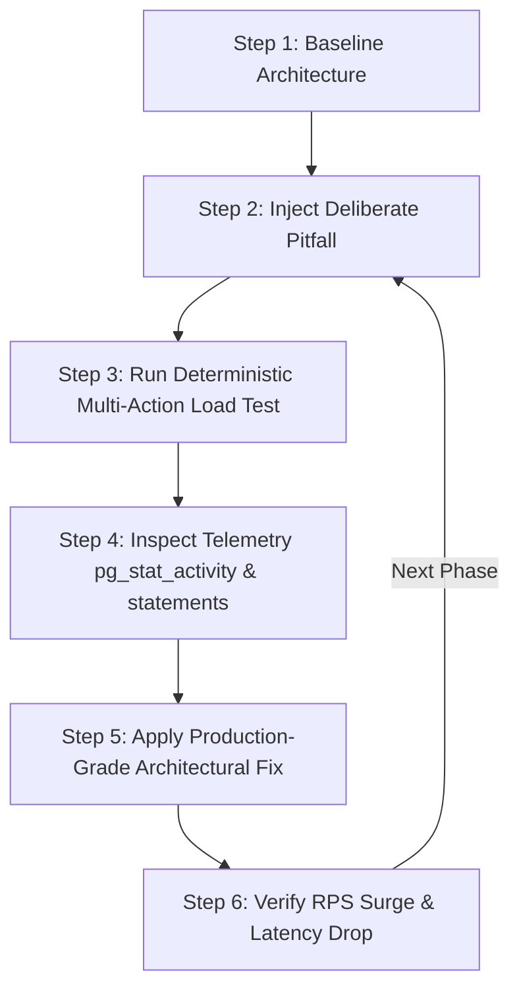

# FastAPI & PostgreSQL High-Load Performance Engineering
## Comprehensive Architectural Guide & 10-Phase Bottleneck Roadmap

---

## 1. Executive Summary & Core Philosophy

### 1.1 The Reality of Backend Development Under Load
Most backend tutorials and documentation teach "happy path" programming: a single developer running tests locally with one browser tab open and a database with fifty mock rows. In that vacuum, almost any architectural pattern appears fast, responsive, and functional.

In high-concurrency production systems, software behaves radically differently. Under load from hundreds or thousands of simultaneous users:
* An innocent synchronous database call inside an `async def` function freezes the entire web application process for every user.
* A missing database index causes PostgreSQL to read gigabytes of data off disk repeatedly, pegging CPU at 100%.
* Unbounded ORM relationship loading turns a single HTTP request into over 100 individual database roundtrips.
* Transactions held open while communicating with third-party APIs starve the application's connection pool, locking out every subsequent user.

These failures rarely produce clean Python stack traces in development. Instead, they manifest as **soaring p99 response latencies, connection timeouts, mysterious 500-level HTTP errors, and server collapse**.

---

### 1.2 The Layman's Analogy: The Restaurant Kitchen
To understand this system intuitively, imagine a high-end restaurant:

```
[ Dining Room: Customers (Load Generator) ]
                     │
                     ▼
       [ Head Waiter / Expediter (FastAPI Event Loop) ]
                     │
         ┌───────────┴───────────┐
         ▼                       ▼
  [ Table Runners (Pool) ]  [ Chefs / Line Cooks (PostgreSQL) ]
```

* **The Customers (`wrk` Load Generator):** Hundreds of guests arriving simultaneously, placing orders, asking for menu adjustments, and requesting the bill.
* **The Head Waiter / Expediter (The FastAPI Event Loop):** A single master coordinator who takes orders and delegates tasks. If this person stops taking orders to run back into the kitchen and chop carrots by hand (a **synchronous blocking call**), nobody gets seated, orders pile up, and the entire dining room halts.
* **The Line Cooks (The PostgreSQL Engine):** A powerhouse team that prepares meals. If the waiters fail to group orders and instead run into the kitchen 100 times for each individual French fry (the **N+1 problem**), the kitchen descends into chaos.
* **The Plates & Serving Trays (Database Connection Pool):** There are only 20 serving trays in the restaurant. If a waiter takes a tray and stands idle waiting for a phone confirmation from an outside supplier (the **Connection Pool Starvation** pitfall), other waiters cannot deliver ready dishes to waiting guests.

---

### 1.3 The Methodology: Scientific Backend Engineering
This curriculum is built on empirical verification, not guesswork. For every failure mode, we follow a strict five-step loop:

$$\text{Hypothesize} \longrightarrow \text{Inject Fault (Pitfall)} \longrightarrow \text{Measure with Telemetry} \longrightarrow \text{Apply Fix} \longrightarrow \text{Verify Recovery}$$



---

## 2. Target Architecture & Testbed Setup

```
                                  +-------------------------------------------------------+
                                  |                     CLIENT LOAD                       |
                                  |              wrk (8 threads, 200 conns)               |
                                  |                     workload.lua                      |
                                  +---------------------------+---------------------------+
                                                              |
                                                    HTTP 1.1  | 60% Read Notes List
                                                              | 20% Read Single Note
                                                              | 10% Create Note
                                                              |  7% Update Note
                                                              |  3% Delete Note
                                                              v
+-----------------------------------------------------------------------------------------------------------------+
|                                                 FASTAPI SERVICE                                                 |
|                                                                                                                 |
|   +--------------------------------+  +--------------------------------+  +---------------------------------+   |
|   |          API Endpoints         |  |      Dependency Injection      |  |           Pydantic DTOs         |   |
|   |         (main.py / routes)     |  |       (dependencies.py)        |  |          (Validation/JSON)      |   |
|   +--------------------------------+  +--------------------------------+  +---------------------------------+   |
|                                                       |                                                         |
|                                                       v                                                         |
|   +---------------------------------------------------------------------------------------------------------+   |
|   |                                          SQLAlchemy 2.0 Async Engine                                    |   |
|   |                                          AsyncSession / asyncpg Driver                                  |   |
|   |                                  QueuePool (pool_size=30, max_overflow=20)                              |   |
|   +---------------------------------------------------------------------------------------------------------+   |
+-------------------------------------------------------+---------------------------------------------------------+
                                                        |
                                            TCP/IP Wire | Connection Pooling
                                                        |
                                                        v
+-----------------------------------------------------------------------------------------------------------------+
|                                              POSTGRESQL DATABASE                                                |
|                                             (Dockerized Container)                                              |
|                                                                                                                 |
|   Configuration:                                                                                                |
|     • shared_preload_libraries = 'pg_stat_statements'                                                           |
|     • pg_stat_statements.track = 'all'                                                                          |
|     • max_connections = 100                                                                                     |
|                                                                                                                 |
|   Seeded Domain State:                                                                                          |
|     • 1,000 Active Users                                                                                        |
|     • 100,000 Notes (avg. 100 per user) with status, timestamps, and tags                                       |
|     • Associated Tag & Counter Tables                                                                           |
|                                                                                                                 |
|   Real-Time Diagnostic Channels:                                                                                |
|     • pg_stat_activity (connection states, lock contention, wait events)                                        |
|     • pg_stat_statements (slowest queries, mean execution times, call counts)                                    |
+-----------------------------------------------------------------------------------------------------------------+
```

---

## 3. Real-Time Telemetry & Observability Harness

Running a load test without observability is like revving a car engine without looking at the dashboard. You will know it broke, but you won't know why.

During every phase of this project, three terminal monitoring channels must run continuously alongside the load generator:

### 3.1 Connection State Monitor (`pg_stat_activity`)
```sql
SELECT state, count(*) 
FROM pg_stat_activity 
GROUP BY state;
```
* **Layman's Terms:** How many telephone lines to the database are currently talking, how many are waiting silently with an active call, and how many are completely empty?
* **Technical Terms:** Tracks states such as `active` (currently executing a query), `idle` (connection open in pool, waiting for work), and `idle in transaction` (connection held inside a `BEGIN ... COMMIT` block without running a statement—a critical indicator of connection leakage or thread stalling).

### 3.2 Lock & Wait-Event Monitor
```sql
SELECT pid, wait_event_type, wait_event, query 
FROM pg_stat_activity 
WHERE wait_event IS NOT NULL 
  AND query NOT LIKE '%pg_stat_activity%';
```
* **Layman's Terms:** Who is standing in line waiting for someone else to put down a book so they can read or write in it?
* **Technical Terms:** Identifies row-level lock contention (`Lock:tuple`), table-level locks (`Lock:relation`), and disk I/O bottlenecks (`IO:DataFileRead`). Vital for diagnosing deadlocks and transaction stalls.

### 3.3 Slow Query & Call-Count Profiler (`pg_stat_statements`)
```sql
SELECT query, calls, round(mean_exec_time::numeric, 2) AS mean_ms, rows 
FROM pg_stat_statements 
ORDER BY mean_exec_time DESC 
LIMIT 5;
```
* **Layman's Terms:** Which specific questions took the longest time for the database to answer, and how many times were those questions asked?
* **Technical Terms:** Aggregated query execution statistics tracked by the PostgreSQL engine. Exposes high `mean_exec_time` (missing indexes, disk thrashing) and unexpectedly high `calls` (the N+1 query cascade).

---

## 4. The Multi-Action Load Simulator (`workload.lua`)

Standard benchmarks often hit a single `GET /` endpoint, giving developers a false sense of security. Real applications experience a mixed distribution of reads, heavy filtering, updates, inserts, and deletes.

The load harness uses `wrk` driven by a Lua script that simulates **1,000 distinct concurrent users**:

| Action | Probability | Target Endpoint | Description & Real-World Equivalent |
| :--- | :--- | :--- | :--- |
| **List Notes** | **60%** | `GET /users/{id}/notes` | Reading feed/inbox. Tests foreign-key lookups, N+1 loading, and pagination. |
| **Get Note Detail** | **20%** | `GET /notes/{id}` | Reading a specific item. Tests primary-key index lookups and DTO serialization. |
| **Create Note** | **10%** | `POST /notes` | Writing new data. Tests single vs bulk insert efficiency and index write overhead. |
| **Update Note** | **7%** | `PUT /notes/{id}` | Editing existing records. Tests lock contention, row versions, and dirty pages. |
| **Delete Note** | **3%** | `DELETE /notes/{id}` | Removing data. Tests cascade checks and foreign key validation overhead. |

---

## 5. The 10-Phase Bottleneck & Recovery Roadmap

---

### Phase 1: Async vs. Sync Event Loop Blocking

#### The Layman's Explanation
Imagine a busy bank teller who handles requests for 100 people in line. Normally, when a customer needs paperwork processed from the vault, the teller stamps the slip, gives it to a runner, and immediately helps the next customer in line. That is **asynchronous I/O**.

Now imagine the teller decides to walk back to the vault themselves, locking the customer window for 2 seconds per person. The entire line freezes. Customers get angry, give up, and walk out. That is what happens when you write an `async def` function in Python that calls synchronous database libraries like `psycopg2`.

#### The Technical Reality & Mechanics
FastAPI runs on an `asyncio` event loop (typically `uvloop` via Uvicorn). The event loop executes in a **single operating system thread**.
* When an endpoint is declared `async def`, FastAPI runs it directly on the event loop thread under the assumption that it will never perform blocking I/O without `await`.
* If code inside an `async def` route invokes synchronous database drivers (`psycopg2` or standard sync SQLAlchemy sessions), the OS thread halts while waiting for network packets from PostgreSQL.
* While the thread is blocked, the event loop cannot process any other incoming connections, heartbeats, or ready tasks. Latency multiplies exponentially across the entire application.

#### Checkpoint A: The Pitfall (Degraded State)
* Code defined with `async def`, but using a synchronous engine:
  ```python
  @app.get("/users/{user_id}/notes")
  async def get_notes(user_id: int):
      # CRITICAL BUG: Blocking sync call inside async event loop!
      with SyncSessionLocal() as session:
          return session.query(Note).filter(Note.user_id == user_id).all()
  ```
* **Telemetry Fingerprint:**
  * Application RPS plunges from ~3,500 down to ~120 RPS.
  * p99 latency spikes above 2,500ms.
  * PostgreSQL CPU remains under 5% because the database is barely receiving queries—the bottleneck is inside Python's frozen event loop.

#### Checkpoint B: The Fix (Production-Grade State)
* Complete migration to `asyncpg` and SQLAlchemy's `AsyncSession`:
  ```python
  @app.get("/users/{user_id}/notes")
  async def get_notes(user_id: int, session: AsyncSession = Depends(get_db)):
      stmt = select(Note).where(Note.user_id == user_id)
      result = await session.execute(stmt)
      return result.scalars().all()
  ```
  *(Alternative fix: If synchronous drivers must be used, define the route as regular `def get_notes()`, allowing FastAPI to automatically offload execution to an external worker threadpool).*
* **Expected Result:**
  * Event loop never blocks; throughput recovers to 3,500+ RPS.
  * p99 latency drops to sub-15ms.

---

### Phase 2: Session Lifecycle & Connection Leaking

#### The Layman's Explanation
Imagine borrowing a book from a library with only 20 copies available. When you finish reading, you leave the book on your desk at home instead of returning it. Soon, every copy is sitting abandoned in people's bedrooms, and nobody else can check out a book. The library signs say "All books checked out," even though nobody is actively reading them.

#### The Technical Reality & Mechanics
Database connections are expensive OS-level TCP sockets and process handles on PostgreSQL. Applications maintain a **Connection Pool** (e.g., 20 connections) to reuse these sockets.
* If a FastAPI route opens a database session manually and encounters an unhandled exception before reaching `session.close()`, or forgets to close the session in all code branches, the underlying connection remains checked out.
* In PostgreSQL, this connection sits in the `idle in transaction` state. The database holds transaction locks and memory buffers for a client that has abandoned the conversation.
* As load increases, the pool is depleted. New HTTP requests hang waiting for an available connection until they time out with `TimeoutError: QueuePool limit reached`.

#### Checkpoint A: The Pitfall (Degraded State)
* Manual session instantiation without context management:
  ```python
  @app.get("/notes/{note_id}")
  async def read_note(note_id: int):
      session = AsyncSessionLocal()
      note = await session.get(Note, note_id)
      # BUG: If an exception occurs or return happens before close, 
      # the connection is leaked permanently!
      if not note:
          raise HTTPException(status_code=404)
      await session.close()
      return note
  ```
* **Telemetry Fingerprint:**
  * `pg_stat_activity` reveals a steady accumulation of sessions in `idle in transaction`.
  * FastAPI logs show `TimeoutError: QueuePool limit of size 20 overflow 10 reached`.
  * Traffic grinds to a complete halt after a few minutes of load.

#### Checkpoint B: The Fix (Production-Grade State)
* FastAPI Dependency Injection with strict async context management:
  ```python
  async def get_db() -> AsyncGenerator[AsyncSession, None]:
      async with AsyncSessionLocal() as session:
          try:
              yield session
              await session.commit()
          except Exception:
              await session.rollback()
              raise
          finally:
              await session.close()
  ```
* **Expected Result:**
  * 100% of checked-out connections are guaranteed to return to the pool, even upon crashes or client disconnections.
  * Zero lingering `idle in transaction` states in PostgreSQL telemetry.

---

### Phase 3: The N+1 Query Cascade

#### The Layman's Explanation
Imagine you go to a grocery store with a shopping list of 10 items. Instead of putting all 10 items into your cart and checking out once, you pick up one apple, wait in line at the cash register, pay for it, walk out to your car, and then walk back into the store to buy one banana. You repeat this 10 times. You spent 99% of your time walking back and forth, not shopping.

#### The Technical Reality & Mechanics
In relational databases, parents (Users) have children (Notes), and Notes have children (Tags).
* By default, ORMs use **Lazy Loading**: they fetch the parent record first. When Python code iterates through the children (`for note in user.notes:`), the ORM transparently issues a brand-new `SELECT * FROM notes WHERE id = ...` SQL statement for every single element.
* Fetching 100 notes with their tags results in **1 query for the user + 100 queries for the notes + 100 queries for the tags = 201 individual network roundtrips**.
* Even if each query takes only 0.5 milliseconds in PostgreSQL, 201 roundtrips over a 1ms network connection add 200ms of pure latency to a single request.

#### Checkpoint A: The Pitfall (Degraded State)
* Accessing relationship attributes without eager-loading strategies:
  ```python
  @app.get("/users/{user_id}/notes-with-tags")
  async def get_user_notes(user_id: int, session: AsyncSession = Depends(get_db)):
      user = await session.get(User, user_id)
      # Triggering lazy queries across relations inside a loop or serializer
      return [{"title": n.title, "tags": [t.name for t in n.tags]} for n in user.notes]
  ```
* **Telemetry Fingerprint:**
  * `pg_stat_statements` shows the `calls` counter for single-record lookups rocketing into the tens of thousands per minute.
  * Network I/O saturates between the backend container and PostgreSQL.
  * Throughput collapses under fewer than 50 concurrent users.

#### Checkpoint B: The Fix (Production-Grade State)
* Eager loading using SQLAlchemy's `selectinload`:
  ```python
  stmt = (
      select(User)
      .where(User.id == user_id)
      .options(
          selectinload(User.notes).selectinload(Note.tags)
      )
  )
  result = await session.execute(stmt)
  user = result.scalar_one_or_none()
  ```
* **Expected Result:**
  * 201 roundtrips collapse into **exactly 3 optimized queries** using SQL `IN (...)` operators.
  * Latency drops by up to 90%; database call counts decrease by two orders of magnitude.

---

### Phase 4: The Pydantic ORM Serialization Trap

#### The Layman's Explanation
Imagine ordering a simple business card with your name and email. Instead of printing just the card, the printing company ships you an entire filing cabinet containing your medical history, tax records, and family photos, then throws away everything except the card. It wastes truck space, packing materials, and handling time.

#### The Technical Reality & Mechanics
FastAPI uses Pydantic to serialize Python objects into JSON response strings.
* When developers set `response_model=NoteSchema` and pass a raw SQLAlchemy ORM model directly to it, Pydantic inspects every attribute of the ORM class.
* In async SQLAlchemy (`asyncpg`), if Pydantic accesses a relationship attribute that was not loaded into memory, Python attempts to trigger a synchronous database read. Because `asyncpg` prohibits synchronous I/O, the program crashes immediately with:
  `sqlalchemy.exc.MissingGreenlet: greenlet_spawn has not been called`
* Furthermore, loading an entire 50-column table row into heavy Python objects when the frontend only asked for `id` and `title` wastes CPU cycles on object allocation and garbage collection.

#### Checkpoint A: The Pitfall (Degraded State)
* Returning full ORM model entities with un-loaded fields to Pydantic:
  ```python
  class NoteOut(BaseModel):
      id: int
      title: str
      tags: list[TagOut] # Unloaded relationship
      class Config:
          orm_mode = True

  @app.get("/notes/{note_id}", response_model=NoteOut)
  async def get_note(note_id: int, session: AsyncSession = Depends(get_db)):
      return await session.get(Note, note_id) # Crashes with MissingGreenlet!
  ```
* **Telemetry Fingerprint:**
  * Spikes in HTTP 500 internal server errors.
  * Significant memory spikes inside the FastAPI container due to large ORM object state tracking.

#### Checkpoint B: The Fix (Production-Grade State)
* Decoupled DTO Projections querying only the required fields:
  ```python
  @app.get("/notes/{note_id}", response_model=NoteSummaryDTO)
  async def get_note(note_id: int, session: AsyncSession = Depends(get_db)):
      stmt = select(Note.id, Note.title).where(Note.id == note_id)
      result = await session.execute(stmt)
      row = result.first()
      if not row:
          raise HTTPException(status_code=404)
      return NoteSummaryDTO(id=row.id, title=row.title)
  ```
* **Expected Result:**
  * Zero runtime `MissingGreenlet` crashes.
  * Drastically lower memory allocation and up to a 40% reduction in serialization CPU overhead.

---

### Phase 5: Connection Pool Starvation & Transaction Scoping

#### The Layman's Explanation
Imagine standing at a busy ATM machine where only 5 people can withdraw cash at once. You put your card in, and the ATM holds your account active. While holding the slot, you pull out your phone, call a friend in another country, chat for 30 seconds about dinner plans, and only then press "Withdraw $20". The line of 100 people behind you is held hostage while you make your phone call.

#### The Technical Reality & Mechanics
Applications frequently need to call external third-party services (Stripe, Twilio, OAuth providers, LLM APIs).
* If an external network call is made **inside** an active database transaction block, the database connection is held exclusively by that request.
* Because network calls over the public internet take 100ms–2,000ms, that database connection sits completely dormant in PostgreSQL.
* With a default connection pool size of 10, just 10 concurrent users calling that endpoint will tie up **100% of all database connections for the entire company**. Every other endpoint (even simple health checks) halts.

#### Checkpoint A: The Pitfall (Degraded State)
* External HTTP I/O performed within an active database transaction:
  ```python
  @app.post("/notes")
  async def create_note(data: NoteCreate, session: AsyncSession = Depends(get_db)):
      # DB transaction begins here
      note = Note(title=data.title, content=data.content)
      session.add(note)
      
      # DISASTER: Holding DB connection while awaiting slow external network I/O!
      async with httpx.AsyncClient() as client:
          auth_resp = await client.get("https://api.external-auth.com/verify-token")
      
      await session.commit()
      return note
  ```
* **Telemetry Fingerprint:**
  * Database CPU is near 0%, yet all incoming requests fail with `QueuePool limit exceeded`.
  * `pg_stat_activity` shows all connections held open in `idle in transaction`.

#### Checkpoint B: The Fix (Production-Grade State)
* Restricting transaction scope: Complete all external network I/O *before* acquiring or touching the database session:
  ```python
  @app.post("/notes")
  async def create_note(data: NoteCreate, session: AsyncSession = Depends(get_db)):
      # 1. External I/O executed with zero database connections held
      async with httpx.AsyncClient() as client:
          auth_resp = await client.get("https://api.external-auth.com/verify-token")
      
      # 2. Database transaction acquired, executed, and released in milliseconds
      note = Note(title=data.title, content=data.content)
      session.add(note)
      await session.commit()
      return note
  ```
* Pool tuning:
  `create_async_engine(..., pool_size=30, max_overflow=20, pool_pre_ping=True)`
* **Expected Result:**
  * DB connection checkout duration drops from 1,200ms to 2ms.
  * System easily absorbs thousands of concurrent requests without pool exhaustion.

---

### Phase 6: Missing Composite Indexes on Filtering Queries

#### The Layman's Explanation
Imagine looking for an old friend named "John Smith who lives in Dallas" in a phone book that is organized only by First Name. You open the book to "John" and find 50,000 Johns. You have to read every single line, looking across to see if their last name is Smith and their city is Dallas. A composite index is like having a special directory organized specifically by `(Last Name, City, First Name)`, letting you flip instantly to the exact page.

#### The Technical Reality & Mechanics
Relational queries rarely filter on just one column. For example, querying `/users/{user_id}/notes?status=archived` filters on both `user_id` and `status`.
* If an index only exists on `user_id`, PostgreSQL uses that index to find all rows matching `user_id` (say, 5,000 notes), loads them off disk into memory, and then performs a **filter operation** checking `status = 'archived'` row-by-row.
* If neither column is indexed, PostgreSQL performs a **Sequential Scan (`Seq Scan`)**, reading all 100,000 rows in the entire table from storage for every single web request.
* At 200 concurrent requests, this locks the database CPU at 100%, causing disk I/O thrashing and query timeouts.

#### Checkpoint A: The Pitfall (Degraded State)
* Filtering on multiple columns without a matching composite index:
  ```sql
  -- Query generated by endpoint
  SELECT * FROM notes WHERE user_id = 42 AND status = 'active';
  ```
* **Telemetry Fingerprint:**
  * `EXPLAIN ANALYZE` outputs: `Seq Scan on notes (cost=0.00..2840.00 rows=... Filter: ((user_id = 42) AND (status = 'active')))`.
  * `pg_stat_statements` shows `mean_exec_time` hovering at 45ms–120ms per query.
  * PostgreSQL container CPU hits 100%.

#### Checkpoint B: The Fix (Production-Grade State)
* Adding a targeted composite B-Tree index:
  ```sql
  CREATE INDEX CONCURRENTLY idx_notes_user_status 
  ON notes (user_id, status);
  ```
* **Expected Result:**
  * `EXPLAIN ANALYZE` switches from `Seq Scan` to `Index Scan using idx_notes_user_status`.
  * `mean_exec_time` drops from 85ms to **0.15ms** (over a 500x speedup).
  * Database CPU drops from 100% to under 15% under heavy load.

---

### Phase 7: Concurrency, Deadlocks & Row Contention

#### The Layman's Explanation
Two cashiers at a bank try to deposit $50 into the same account at the exact same millisecond. Both look up the balance ($100). Both add $50 in their heads ($150). Both write back $150. In reality, $100 was deposited, but the final balance shows $150 instead of $200. One deposit disappeared into thin air. Even worse, if Cashier A locks Account 1 and wants Account 2, while Cashier B locks Account 2 and wants Account 1, both stand frozen staring at each other forever (a **Deadlock**).

#### The Technical Reality & Mechanics
When concurrent transactions read and write to the same row (such as incrementing a user's `note_count` or quota):
* **Lost Updates:** A classic `SELECT note_count ...` followed by Python math `count + 1` and `UPDATE ... SET note_count = :count` creates a race condition. Concurrent threads overwrite each other's calculations.
* **Deadlocks:** If Transaction A updates Note 1 then Note 2, while Transaction B updates Note 2 then Note 1, PostgreSQL detects a cyclical dependency:
  `ERROR: deadlock detected - Process 1234 waits for ShareLock on transaction; Process 5678 waits for ShareLock...`
  PostgreSQL forcibly aborts one of the transactions, resulting in an unhandled 500 error for the user.

#### Checkpoint A: The Pitfall (Degraded State)
* Application-level read-modify-write without row locks:
  ```python
  @app.post("/users/{user_id}/increment-notes")
  async def increment_notes(user_id: int, session: AsyncSession = Depends(get_db)):
      user = await session.get(User, user_id)
      # BUG: Race condition! Multiple workers read the same stale value
      user.note_count = user.note_count + 1
      await session.commit()
      return {"count": user.note_count}
  ```
* **Telemetry Fingerprint:**
  * Under 200 concurrent users, the final counter in the database is off by 40%–60% due to lost updates.
  * PostgreSQL log files fill with `deadlock detected` error messages.
  * High lock wait events visible in `pg_stat_activity`.

#### Checkpoint B: The Fix (Production-Grade State)
* **Approach 1: Single Atomic SQL Update (Fastest, zero lock contention):**
  ```python
  stmt = (
      update(User)
      .where(User.id == user_id)
      .values(note_count=User.note_count + 1)
  )
  await session.execute(stmt)
  await session.commit()
  ```
* **Approach 2: Pessimistic Row Locking (`SELECT ... FOR UPDATE`):**
  ```python
  stmt = select(User).where(User.id == user_id).with_for_update()
  result = await session.execute(stmt)
  user = result.scalar_one()
  user.note_count += 1
  await session.commit()
  ```
* **Expected Result:**
  * Exact data consistency (zero lost updates).
  * Elimination of deadlock exceptions.

---

### Phase 8: Keyset (Cursor) vs. `OFFSET` Pagination

#### The Layman's Explanation
Imagine a dictionary with 100,000 words. You want to see page 500.
* **Offset Pagination:** You are forced to start at page 1, count every single word on pages 1 through 499 one by one, throw them in the trash, and only then read page 500. When you want page 501, you start at page 1 all over again.
* **Keyset Pagination:** You open the dictionary directly to the letter 'T' where you left off. You read the next 20 words instantly.

#### The Technical Reality & Mechanics
Almost all REST APIs implement pagination using `LIMIT` and `OFFSET`.
* When executing `SELECT * FROM notes ORDER BY id DESC LIMIT 20 OFFSET 50000;`, PostgreSQL does not magically jump to row 50,000.
* The query engine must traverse the index or disk pages to locate 50,020 rows, sort them in memory, discard the first 50,000, and return the remaining 20.
* As users scroll deeper into feeds or scrapers harvest data, query response times increase **linearly with the offset size**. At high offsets, single queries consume hundreds of megabytes of buffer memory and take seconds to execute.

#### Checkpoint A: The Pitfall (Degraded State)
* High offset pagination queries:
  ```python
  @app.get("/notes")
  async def list_notes(page: int = 1, page_size: int = 20, session: AsyncSession = Depends(get_db)):
      offset = (page - 1) * page_size
      stmt = select(Note).order_by(Note.id.desc()).offset(offset).limit(page_size)
      result = await session.execute(stmt)
      return result.scalars().all()
  ```
* **Telemetry Fingerprint:**
  * At `page=1` (`OFFSET 0`): Response time is **2ms**.
  * At `page=2500` (`OFFSET 50000`): Response time shoots up to **280ms**.
  * High buffer hit rates and memory churn inside PostgreSQL.

#### Checkpoint B: The Fix (Production-Grade State)
* Keyset / Cursor-Based Pagination:
  ```python
  @app.get("/notes/cursor")
  async def list_notes_cursor(
      last_seen_id: Optional[int] = None, 
      limit: int = 20, 
      session: AsyncSession = Depends(get_db)
  ):
      stmt = select(Note).order_by(Note.id.desc()).limit(limit)
      if last_seen_id:
          stmt = stmt.where(Note.id < last_seen_id)
      result = await session.execute(stmt)
      return result.scalars().all()
  ```
* **Expected Result:**
  * Constant $O(1)$ query execution time.
  * Fetching items after ID 50,000 takes the exact same time as fetching from ID 1: **sub-1 millisecond**.

---

### Phase 9: Bulk Insert Overhead & Round-Trip Saturation

#### The Layman's Explanation
Imagine a postman delivering 100 letters to the same office building. Instead of carrying all 100 letters inside in a sack, he carries one letter into the lobby, hands it to the receptionist, walks back out to his truck, drives around the block, and comes back with the second letter. He repeats this 100 times. Carrying the sack once takes 1 minute; walking back and forth takes 2 hours.

#### The Technical Reality & Mechanics
When importing data or creating collections of records, developers often write loops:
```python
for item in payload:
    session.add(Note(**item))
    await session.flush()
```
* Each `session.flush()` sends a discrete SQL statement over the network socket, waits for PostgreSQL to parse the query, write to the Write-Ahead Log (WAL), and send a network acknowledgement back.
* Creating 100 records takes 100 network roundtrips and 100 individual transaction flushes.
* The network wire and CPU become saturated with protocol framing and context switching rather than actual data persistence.

#### Checkpoint A: The Pitfall (Degraded State)
* Iterative row insertion with individual flushes:
  ```python
  @app.post("/notes/bulk-slow")
  async def create_notes_slow(notes: list[NoteCreate], session: AsyncSession = Depends(get_db)):
      created = []
      for n in notes:
          note = Note(title=n.title, content=n.content, user_id=n.user_id)
          session.add(note)
          await session.flush() # Disastrous per-row network roundtrip!
          created.append(note.id)
      await session.commit()
      return {"count": len(created)}
  ```
* **Telemetry Fingerprint:**
  * Inserting 500 rows takes **1,800ms**.
  * `pg_stat_statements` registers 500 distinct `INSERT INTO notes ...` query calls.
  * Massive WAL write amplification.

#### Checkpoint B: The Fix (Production-Grade State)
* High-Performance Multi-Row Batch Inserts:
  ```python
  @app.post("/notes/bulk-fast")
  async def create_notes_fast(notes: list[NoteCreate], session: AsyncSession = Depends(get_db)):
      records = [n.model_dump() for n in notes]
      stmt = insert(Note).values(records).returning(Note.id)
      result = await session.execute(stmt)
      await session.commit()
      return {"ids": result.scalars().all()}
  ```
* **Expected Result:**
  * 500 rows inserted in a single multi-row `INSERT INTO notes (...) VALUES (...), (...), (...)` statement.
  * Execution time drops from **1,800ms down to 18ms** (a 100x improvement).

---

### Phase 10: Multiprocessing, Event Loop Sizing & CPU Saturation

#### The Layman's Explanation
Imagine a toll booth highway with 8 open lanes, but only 1 lane has a toll collector standing in it. Even if that collector works at lightning speed, cars back up for miles while the other 7 lanes sit completely empty. If you put 8 collectors in all 8 lanes, the traffic jam clears in seconds.

#### The Technical Reality & Mechanics
Python features a **Global Interpreter Lock (GIL)**.
* Standard `uvicorn main:app` runs as a **single operating system process**.
* A single Uvicorn process can only ever utilize **one single CPU core**, regardless of whether your production server has 8, 16, or 64 cores.
* Even with 100% non-blocking async database I/O, tasks like parsing incoming JSON payloads, validating Pydantic models, compiling SQL strings, and serializing JSON responses are **CPU-bound operations**.
* Once that single CPU core reaches 100% utilization, the event loop can no longer process network events in a timely manner. Throughput hits a hard ceiling around 3,500–4,500 RPS on modern hardware, leaving the remaining CPU cores at 0% utilization.

#### Checkpoint A: The Pitfall (Degraded State)
* Running a single worker process on multi-core hardware:
  ```bash
  uvicorn main:app --host 0.0.0.0 --port 8000
  ```
* **Telemetry Fingerprint:**
  * Host CPU monitoring (`htop` or `docker stats`) reveals **Core 1 at 100%**, while Cores 2 through 8 sit completely idle at 1%.
  * RPS plateaus at ~4,000 RPS. Increasing concurrency from 200 to 500 connections only increases latency without adding a single extra request per second.

#### Checkpoint B: The Fix (Production-Grade State)
* Process clustering matching hardware capacity:
  ```bash
  # Option 1: Native Uvicorn multi-worker mode
  uvicorn main:app --host 0.0.0.0 --port 8000 --workers 4

  # Option 2: Production Gunicorn master process with Uvicorn worker classes
  gunicorn main:app \
      --workers 4 \
      --worker-class uvicorn.workers.UvicornWorker \
      --bind 0.0.0.0:8000 \
      --backlog 2048
  ```
* **Expected Result:**
  * All 4 CPU cores share the incoming connection queue via kernel socket binding (`SO_REUSEPORT`).
  * Total application throughput scales near-linearly from ~4,000 RPS to **14,000+ RPS**.

---

## 6. Comprehensive Summary Matrix & Diagnostic Cheat Sheet

| Phase | Root Cause Layer | Layman's Clue | Telemetry Fingerprint | Architectural Solution | Expected Impact |
| :---: | :--- | :--- | :--- | :--- | :--- |
| **1** | **Python Event Loop** | Waiter stops seating people to chop vegetables. | App RPS drops to ~100; DB CPU < 5%; p99 latency > 2s. | Migrate to `asyncpg` + `AsyncSession` (or `def` threadpool). | **RPS: 120 $\rightarrow$ 3,500+** |
| **2** | **Connection Lifecycle** | Borrowed library books left at home permanently. | `idle in transaction` climbs in `pg_stat_activity`; Pool timeouts. | FastAPI `async with` dependency injection yielding session. | **Zero connection leaks; rock-solid stability.** |
| **3** | **ORM Data Access** | Going to the store 100 times for 100 groceries. | High `calls` for single-row queries in `pg_stat_statements`. | `selectinload()` eager loading; single `WHERE IN` query. | **90% reduction in latency; $201 \rightarrow 3$ queries.** |
| **4** | **Serialization / Pydantic** | Shipping a full filing cabinet to deliver a business card. | `MissingGreenlet` crashes; high Python memory churn. | Decoupled DTO projections (`select(Col1, Col2)`). | **Zero crashes; 40% lower serialization CPU.** |
| **5** | **Resource Scope** | Chatting on the phone at the ATM while holding the slot. | Pool exhaustion while DB CPU is near 0%; high queue latency. | Execute external HTTP calls *before* acquiring DB session. | **Checkout time: $1.2\text{s} \rightarrow 2\text{ms}$.** |
| **6** | **Database Engine** | Reading the entire phone book to find one person. | `Seq Scan` in `EXPLAIN`; `mean_exec_time` > 50ms; DB CPU 100%. | Composite index `CREATE INDEX idx (user_id, status)`. | **Query time: $85\text{ms} \rightarrow 0.15\text{ms}$.** |
| **7** | **Concurrency Control** | Two cashiers updating the same account at the same time. | `deadlock detected` in Postgres logs; lost counter updates. | Atomic SQL updates or `SELECT ... FOR UPDATE` row locks. | **100% data consistency; zero deadlocks.** |
| **8** | **Query Architecture** | Reading pages 1 to 499 just to view page 500. | Query latency climbs linearly with page depth (`OFFSET 50000`). | Keyset / Cursor pagination (`WHERE id < :cursor LIMIT 20`). | **Constant sub-millisecond pagination.** |
| **9** | **Write Throughput** | Carrying 100 letters into the post office one by one. | High network roundtrips; hundreds of separate `INSERT` calls. | Batched multi-row `insert().values([...])`. | **Bulk write time: $1,800\text{ms} \rightarrow 18\text{ms}$.** |
| **10** | **Process Sizing** | 8 highway lanes open, but only 1 toll collector working. | Core 1 pegged at 100%; Cores 2–8 idle; throughput capped. | Multi-worker cluster (`gunicorn -w 4 -k uvicorn.workers...`). | **Throughput scales linearly across cores.** |

---

## 7. Interactive Learning Workflow Runbook

For every phase in this roadmap, you will follow a standard lab procedure:

```
[ Step A: Implement Pitfall Code ]
               │
               ▼
[ Step B: Start Postgres Telemetry Monitors ]
  - Terminal 1: Connection State Watcher
  - Terminal 2: Lock Contention Watcher
  - Terminal 3: Slow Query Logger
               │
               ▼
[ Step C: Run wrk Load Generator ]
  - wrk -t8 -c200 -d30s -s workload.lua http://localhost:8000/
               │
               ▼
[ Step D: Record Degraded Metrics (RPS, Latency, Errors) ]
               │
               ▼
[ Step E: Apply Architectural Fix ]
               │
               ▼
[ Step F: Re-run wrk Load Generator & Record Recovery ]
```

With this architectural guide in place, you are ready to construct the baseline infrastructure, telemetry harnesses, and progress systematically through each phase.
